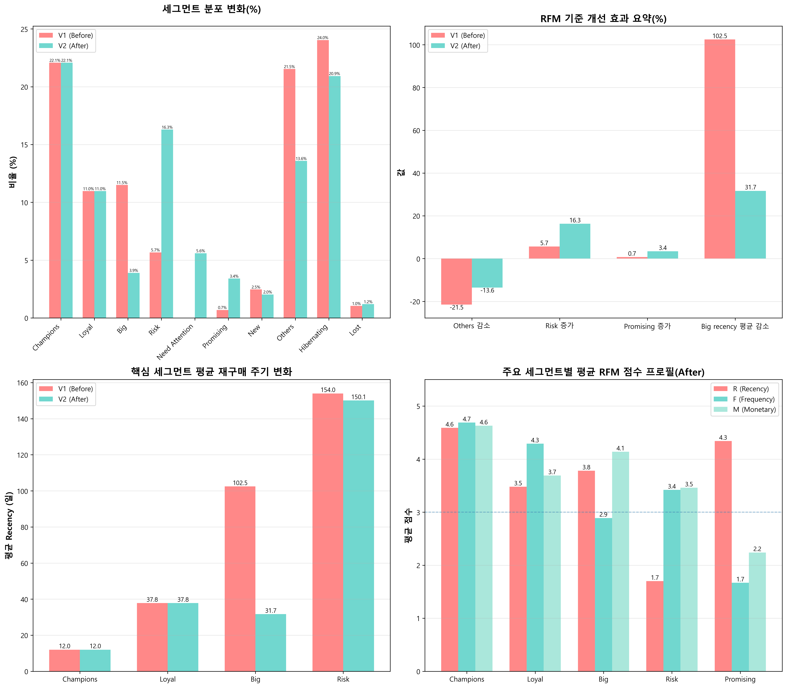

# ecommerce_analysis
PostgreSQL 기반 이커머스 고객 코호트 분석 및 시각화

## 📌 프로젝트 개요
온라인 쇼핑몰 고객 데이터를 분석하여 매출 최적화 전략 수립

- **작업 기간**: 2025.12.13 ~ 진행 중
- **목적**: 고객 리텐션 분석 및 세그먼트별 마케팅 전략 수립
- **데이터**: Kaggle Online Retail Dataset (2010-2011, 약 50만 건)
- **기술 스택**: PostgreSQL, Python, jupyter Notebook, DBeaver, Tableau, Git

## 🎯 분석 목표
1. 코호트 분석: 월별 신규 고객의 재구매율 추적
2. RFM 세그먼테이션: 고객 등급화 및 타겟팅
3. 퍼널 분석: 구매 전환율 개선 포인트 도출
4. Tableau 대시보드: 실시간 모니터링 환경 구축

## 📂 프로젝트 구조
```
📁 ecommerce-cohort-analysis/
├── data/        # 데이터 파일 
├── sql/         # 핵심 분석 쿼리
├── notebooks/   # jupyter notebook (파이썬)
├── tableau/     # 대시보드 파일
└── docs/        # 분석 결과 및 의사결정 문서
```

## 🚀 진행 상황
- [x] 프로젝트 초기 설정
- [x] 데이터 다운로드

- [x] **EDA**
  - 결측치 분석: CustomerID 24.9%, Description 0.27%
  - 이상치 발견: 음수 수량 10,624건 (반품 데이터)
  - 특수 코드 패턴 파악: 'C' 인보이스 = 취소 주문

- [x] 데이터 전처리
  - 이상치 처리: 음수 금액 제거, 'A'인보이스 3건 제거 
  - 데이터 타입 변환: InvoiceDate → datetime
  - **산출물**:
   - `cleaned_data.csv`: 정제된 데이터
   - `preprocessing_decision.md`: 전처리 과정 상세 기록

- [x] PostgreSQL DB 구축
  - **산출물**:
   - '01_create_table&load_data.sql': sql 테이블 생성 및 데이터 적재 
   - '03_sql_load_data.ipynb': 파이썬으로 sql 데이터 로드 

- [x] 코호트 분석
  - **목표**: 고객의 시간에 따른 재구매 패턴 파악

  **분석 방법**:
 1. 각 고객의 첫 구매 월 정의 (Cohort Month)
 2. 파생변수 생성 (totalprice, yearmonth, year, month, dayofweek, hour), 인덱스 생성
 3. 코호트별 월별 재구매 고객 수 집계
 4. 리텐션율 계산 및 히트맵 시각화

  **분석 과정**:
 1. 초기 버전 (`03_cohort_analysis.sql`): CTE로 모든 계산 처리
 2. 파생변수 추가 (`04_add_derived_columns.sql`): 반복 계산 제거
 3. 개선 버전 (`05_cohort_analysis_v2.sql`): 단순화 및 성능 향상
   
  **산출물**:
  - `cohort_analysis.sql`: SQL 분석 쿼리
  - `cohort_results.csv`: 분석 결과 데이터
  - `cohort_heatmap.png`: 리텐션율 히트맵

- [x] RFM 세그먼테이션
  - **분석 목적**: 고객을 구매 행동 패턴(Recency, Frequency, Monetary)에 따라 9개 세그먼트로 분류하여 차별화된 마케팅 전략 수립

  **주요 결과**
  - **분석 대상**: 4,338명
  - **핵심 세그먼트**:
    - Champions (22.08%, 958명): 최우수 고객 - VIP 프로그램 대상
    - Risk (16.30%, 707명): 이탈 위험 고객 - 재활성화 캠페인 우선순위
    - Loyal (10.97%, 476명): 충성 고객 - 멤버십 혜택 강화
    - Big (3.90%, 169명): 고액 구매자 - 프리미엄 상품 추천

  **초기 분석 후 세그먼트 조정 **
 1. **Others 세그먼트 과다 문제 해결** (21.53% → 13.58%)
    - 세그먼트 기준 조정 및 "Need Attention" 신설로 명확한 분류 달성
 2. **숨어있던 이탈 위험 고객 발견** (5.67% → 16.30%)
    - Big Spenders 중 장기 미구매 고객 707명을 At Risk로 재분류
    - 재활성화 캠페인 우선 타겟 확보
 3. **신규 고객 육성 전략 수립 가능** (0.69% → 3.41%)
    - Promising 세그먼트 148명 확보로 육성 프로그램 운영 가능

  **개선 효과 비교** (Before vs After)
  
  

  **산출물**
  1) **분석 문서**
    - [RFM 의사결정 로그](docs/rfm_decision_log.md) - 세그먼트 기준 조정 과정 상세
    - [비즈니스 액션 플랜](docs/rfm_business_action.md) - 세그먼트별 실행 전략 (준비 중)

  2) **SQL 쿼리**
    - [RFM 분석 V1](sql/06_rfm_analysis_v1.sql) - 초기 버전
    - [RFM 분석 V2](sql/07_rfm_analysis_v2.sql) - 개선 버전 (최종)

   **생성한 뷰**
    - `rfm_customer_segments` - 초기 분석 결과
    - `rfm_customer_segments_v2` - 개선 분석 결과 (현재 버전)
    - `rfm_segment_summary_v1` - V1 세그먼트별 집계
    - `rfm_segment_summary_v2` - V2 세그먼트별 집계

  3) **시각화**
    - [개선 Before/After 비교 차트](docs/images/rfm_before_after_comparison.png)
    - [RFM 히트맵 분석](docs/images/rfm_heatmap_analysis.png)
    - [분석 노트북](notebooks/05_rfm_visualization.ipynb)

- [x] 퍼널 분석 (세그먼트별 전환율 비교)
	- 구매 이력 기반 퍼널 정의 (First → Loyal)
	- SQL로 단계별 전환율 및 이탈률 산출
	- Python으로 퍼널, 세그먼트 히트맵, Risk 흐름 시각화
	- 핵심 발견:
  		- 첫 구매 → 재구매 구간이 최대 병목
  		- 2회 구매가 충성 고객 전환의 핵심 터닝 포인트
  		- Risk 세그먼트의 3→4 단계 이탈 집중 관리 필요
- [x] 장바구니 분석(Market Basket Analysis) 
 1. 전체 분석 대상:
   - 주문 수: 18,402개
   - 상품 수: 3,659개
   - 고객 수: 4,334명

2. 빈발 항목 집합:
   - 최소 지지도: 2.0%
     - 초기 1% 설정 시 연산 속도 이슈로 2%로 튜닝
   - 발견된 빈발 항목: 242개

3. 연관 규칙:
   - 생성된 전체 규칙: 76개
   - 필터링 후 의미 있는 규칙: 68개
     - Lift > 2
     - Confidence > 30%
     - Support > 1%

4. 주요 인사이트(예시):
1위 항목: ROSES REGENCY TEACUP AND SAUCER , GREEN REGENCY TEACUP AND SAUCER → PINK REGENCY TEACUP AND SAUCER
- Lift: 23.86 | Confidence: 72.1% | Support: 2.12%
- 해석: 'ROSES REGENCY TEACUP AND SAUCER , GREEN REGENCY TEACUP AND SAUCER'를 구매한 고객은 일반 고객보다 23.9배 더 'PINK REGENCY TEACUP AND SAUCER'를 구매함

- [x] 세그먼트별 상품 선호도 분석

1. 분석 대상
   - RFM 기반 고객 세그먼트 활용
   - SQL 집계 뷰 + Python 시각화 분석

2. 분석 내용
   - 세그먼트별 구매 카테고리 분포 분석
   - 세그먼트별 TOP 상품 추출
   - VIP(Champions) vs 신규(New) 고객 구매 패턴 비교
   - 구매 빈도, 객단가, 카테고리 다양성 비교

3. 주요 지표
   - 카테고리 구매 비중
   - 평균 구매 금액(AOV)
   - 구매 빈도
   - 선호도 지수 (Segment Preference Index)

4. 시각화 산출물
   - 세그먼트별 구매 패턴 비교 차트
   - Champions vs New 비교 차트
   - 세그먼트별 TOP 상품 시각화
   - 세그먼트-상품 히트맵

5. 활용 목적
   - 세그먼트별 맞춤 상품 추천
   - 타겟 프로모션 및 캠페인 기획
   - MD 및 재고 전략 개선

- [ ] 이탈 예측 모델 구축 (Risk → Lost 예측)
- [ ] Tableau 대시보드

## 📊 예상 결과물
- SQL 분석 쿼리 (코호트, RFM, 퍼널)
- Tableau 인터랙티브 대시보드
- 비즈니스 인사이트 보고서

## Data
Raw data files are excluded from the repository via `.gitignore`

## Environment Setup
1. Copy `.env.example` to `.env`
2. Fill in your PostgreSQL credentials
3. Run the notebook/script
