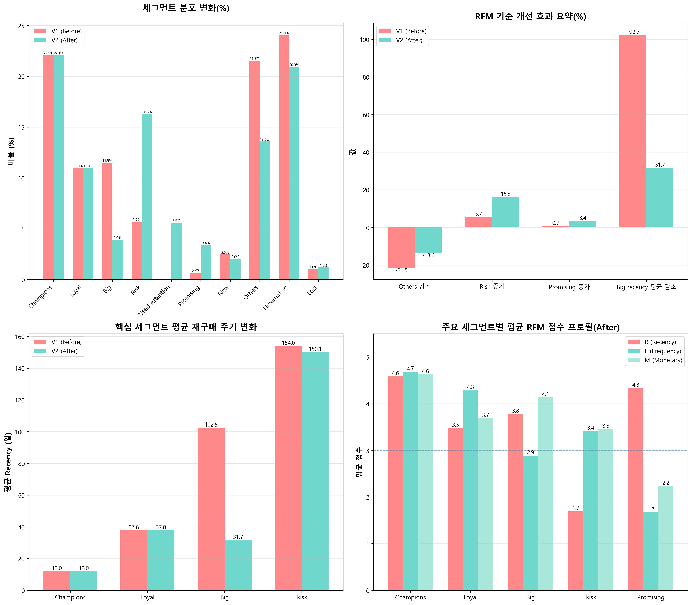

# ecommerce_analysis

- **작업 기간**: 2025.12.13 ~ 진행 중
- **데이터**: Kaggle Online Retail Dataset (2010-2011, 약 50만 건)

## 📌 프로젝트 개요
본 프로젝트는 UK 온라인 리테일 거래 데이터를 활용하여  
이커머스 서비스에서 발생하는 고객 구매 데이터를  
DB → 분석 → 시각화까지 하나의 흐름으로 진행하였다. 

PostgreSQL을 활용해 데이터를 적재하고,  
SQL과 Python을 통해 고객 행동을 분석하여  
데이터 기반 의사결정에 활용 가능한 인사이트 도출을 목표로 한다.

### 🛠 기술 스택
- Database: PostgreSQL (DBeaver)
- Analysis: SQL, Python (pandas, numpy)
- Visualization: matplotlib, seaborn
- Version Control: Git, GitHub


## 🎯 프로젝트 목표
- DB 기반 실무형 데이터 분석 프로세스 경험
- 이커머스 고객 구매 데이터를 활용한 대표 분석 기법 학습
- 분석 결과를 비즈니스 관점에서 해석하는 연습
- 분석 효율을 고려한 DB 구조 설계 및 SQL 활용


### 주요 분석 주제
1. 코호트 분석: 고객 리텐션 추적(월별 신규 고객의 재구매율)
2. RFM 세그먼테이션: 고객 등급화 및 타겟팅
3. 퍼널 분석: 구매 전환 병목 구간 파악 및 구매 전환율 개선 포인트 도출


## 📂 프로젝트 구조
```
📁 ecommerce-analysis/
├── data/        # 데이터 파일 
├── sql/         # 핵심 분석 쿼리
├── notebooks/   # jupyter notebook (파이썬)
├── tableau/     # 대시보드 파일
└── docs/        # 분석 결과 및 의사결정 문서
```

## 🔍 분석 프로세스 요약
1. 데이터 이해 및 품질 점검 (EDA)
2. 분석 목적에 맞는 데이터 전처리
3. PostgreSQL 기반 데이터 적재 및 구조 설계
4. SQL 및 Python을 활용한 분석
5. 시각화 및 인사이트 도출

## 프로젝트 초기 설정
- git ignore

## 데이터 전처리 및 품질 관리
1. **EDA** 후 아래의 내용 확인
  - 결측치 분석: CustomerID 24.9%, Description 0.27%
  - 이상치 발견: 음수 수량 및 금액 10,624건 -> 취소 및 반품 주문으로 추정
  - 특수 코드 패턴 파악: 'C' 인보이스 -> 취소 및 반품 주문으로 추정
2. 데이터 전처리 
  - 이상치 처리: 음수 금액 제거, 'A'인보이스 3건 제거(회계조정)
  - 데이터 타입 변환: InvoiceDate(datetime)
  - 전처리 기준 및 의사결정 근거는 'docs/preprocessing_decision.md`에 상세히 기록

## PostgreSQL DB 구축 
- '01_create_table&load_data.sql': sql 테이블 생성 및 데이터 적재 쿼리
- '03_sql_load_data.ipynb': 파이썬으로 sql 데이터 로드  
- 'docs/db_nomalization_log' : 데이터 모델 정규화 및 구조 개선    


## 주요 분석 요약

### 코호트 분석
- 월별 신규 고객 기준 재구매 패턴 분석
- 리텐션율 히트맵 시각화
- 첫 구매 이후 이탈 구간 확인
**분석 쿼리**
`03_cohort_analysis.sql` -> 04 -> `05_cohort_analysis_v2.sql` 과정으로 단순화 및 성능 향상

### RFM 세그먼테이션
- 고객을 구매 행동 패턴(Recency, Frequency, Monetary)에 따라 9개 세그먼트로 분류
- 세그먼트 기준 재조정으로 분류 정확도 개선
- 이탈 위험 고객(At Risk) 비중 명확화

  **개선 효과 비교** (Before vs After)
  

 **분석 쿼리**
 'sql/07_rfm_analysis_v2.sql', 그 외의 상세 분석은 'docs/','sql/','notebooks/' 디렉토리 내의 rfm_파일 참고


### 퍼널 분석 (세그먼트별 전환율 비교)
- 첫 구매 → 재구매 → 충성 고객 전환 퍼널 정의
- 첫 재구매 구간이 가장 큰 병목 구간임을 확인
- 세그먼트별 전환율 차이 비교

### 상품 연관 / 선호도 분석
- 장바구니 분석(Market Basket Analysis) 
	- Market Basket Analysis를 통한 연관 규칙 도출
- RFM 세그먼트별 상품 선호도 분석
	- 세그먼트별 상품 선호 패턴 비교
	- MD/프로모션 전략 활용 가능성 도출

## 향후 추가 분석 계획
- 시계열 예측
- 고객 생애 가치(LTV) 분석
- 이탈 예측 모델 구축 (Risk → Lost 예측)
- Tableau 대시보드 시각화

## 산출물 요약
- SQL 분석 쿼리 (코호트, RFM, 퍼널)
- 분석 결과 CSV 및 시각화 이미지
- 분석 노트북 (Python)
- 전처리 및 의사결정 기록 문서
📎 각 분석 단계의 상세 코드와 결과는 `/notebooks`,`/sql`,`/docs` 디렉토리에서 확인가능

## Data
Raw data files are excluded from the repository via `.gitignore`

## Environment Setup
1. Copy `.env.example` to `.env`
2. Fill in your PostgreSQL credentials
3. Run the notebook/script
